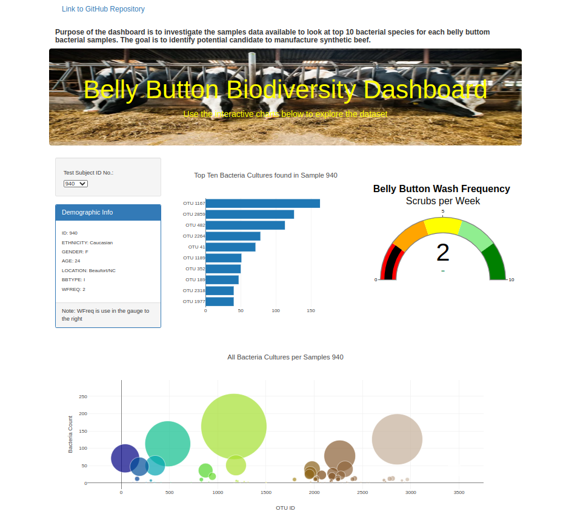

# Biodiversity_with_Plotly
Using Plotly, a JavaScript data visualization library, to create interactive data visualizations

## Background
### Overview
This project consists of four technical analysis deliverables.

- Deliverable 1: Create a Horizontal Bar Chart

- Deliverable 2: Create a Bubble Chart

- Deliverable 3: Create a Gauge Chart

- Deliverable 4: Customize the Dashboard

### Purpose

The client had a partially completed dashboard that  needed to be finished. She had a completed panel for demographic information and now needs to visualize the bacterial data for each volunteer. The Purpose of the dashboard is to investigate the samples data available to look at the top 10 bacterial species for each belly buttom bacterial samples. The goal is to identify potential species as a candidate to manufacture synthetic beef, that way her volunteers will be able to identify whether that species is found in their navel.

## Methodology
- Using JavaScript, Plotly, and D3.js, we created a horizontal bar chart, a bubble chart and a gauge chart to display the top 10 bacterial species.

- Using HTML and Bootstrap we customized the webpage for our dashboard.

## Resources
 
Data source:
- (1) sample.json, (2) index.html, (3) chart.js
 
Software:
- Visual Studio Code 1.68.1, HTML, CSS, Bootstrap and JavaScript
 
 

### Results

Using JavaScript, Plotly, and D3, we re-factored the code of our index.html file to create a dashboard and then we modified the webpage using HTML and Bootstrap as shown in image (a).

 

(a)
 
 Figure (a) Dashboard

 

## Summary

- For this project we were able to create a dynamic dashboard that provided the client an effective way to filter the data for each bacterial sample, and provided 3 vizualizations that changed accordenly with the sample selection. In order to let the client to try and feel the app we deployed the webpage using GitHub pages:

     - [link to deployed webpage](https://l-aldarondo.github.io/Biodiversity_with_Plotly/)

 

## References

[Markdown](https://docs.github.com/en/get-started/writing-on-github/getting-started-with-writing-and-formatting-on-github/basic-writing-and-formatting-syntax)
 
[Plotly gauge chart](https://plotly.com/javascript/gauge-charts/)
 
[Bootstrap CSS](https://getbootstrap.com/docs/3.3/css/)

